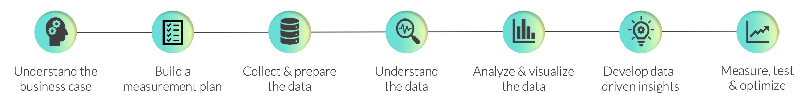

# 💭 Thinking Like an Analyst

This file contains the key takeaways I had from the course offered by [Maven Analytics](https://www.mavenanalytics.io/course/thinking-like-an-analyst).

The course contained information to help apply proven frameworks and practice the application of strategic thinking through case studies.

## 📌 Key takeaways to be a great Analyst

Following are the core attributes required to be a great analyst:

### Strategic Thinking

Understanding business objectives or specific problems, identifies key success or failure factors, and developing concise, tactical analysis and measurement strategies are all aspects of strategic thinking.

Strategic Thinking is most critical at early stages of the analytics workflow

### Technical Proficiency

Technical Proficiency is the ability to execute. This is where **hard-skills** like writing code, carrying out ETL activities and data visualization matter.

Technical skills help in being effecient with analysis and being a valuable contributor to the analytical projects.

### Communication Skills

The ability to translate raw data to end users by communicating clearly. Additionally, it includes the ability to listen and interpret feedback effectively. 

## Data Analysis Workflow

Workflow to set clear expectations, define and measure key outcomes, improve accuracy and efficiency, and consistently deliver insightful, high-quality work:

### Understand the business case

- Think like a business owner
- Understand the specific outcomes you are trying to impact
- Understand who the key stakeholders are and what motivates them

> This will help aligning on requirements, project scope, and desired outcomes from day one.

**KEY QUESTIONS**:

- Which goals or business outcomes am I trying to impact?
- Who are the key stakeholders, and how will this help them?
- How does my work fit into the overall business strategy?

### Build a measurement plan

- It is a roadplan for success
- Defines what a successful outcome looks like for the business, determining which KPIs align with that outcome, and identifying the data needed to capture, track and optimize the metrics
- Critical step to deliver data-driven insights and outcomes

**KEY QUESTIONS**:

- What exactly does success look like for this analysis?
- Which specific metrics will help me quantify success?
- What data will I need to capture and track my KPIs?

### Collect & prepare the data

### Understand the data

### Analyze & visualize the data

### Develop data-driven insights

### Measure, test & optimize
